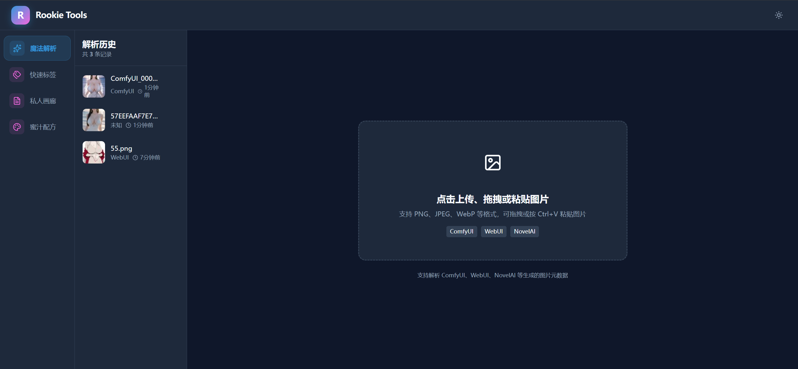
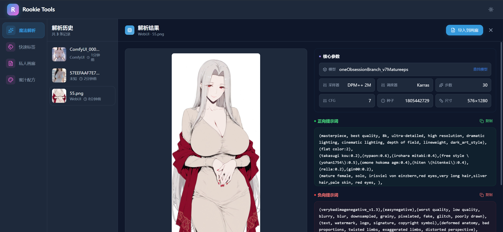
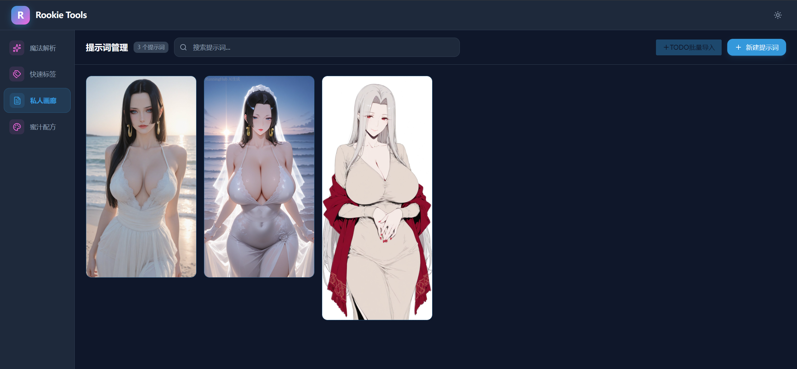
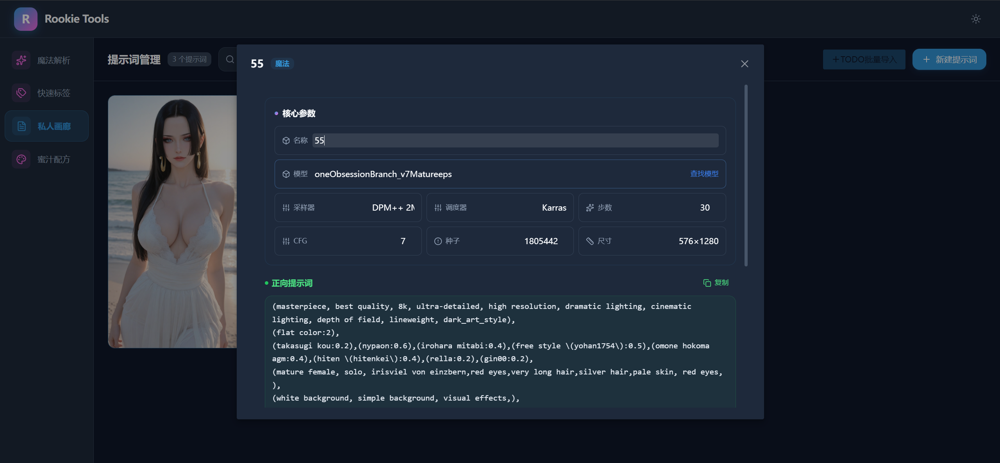
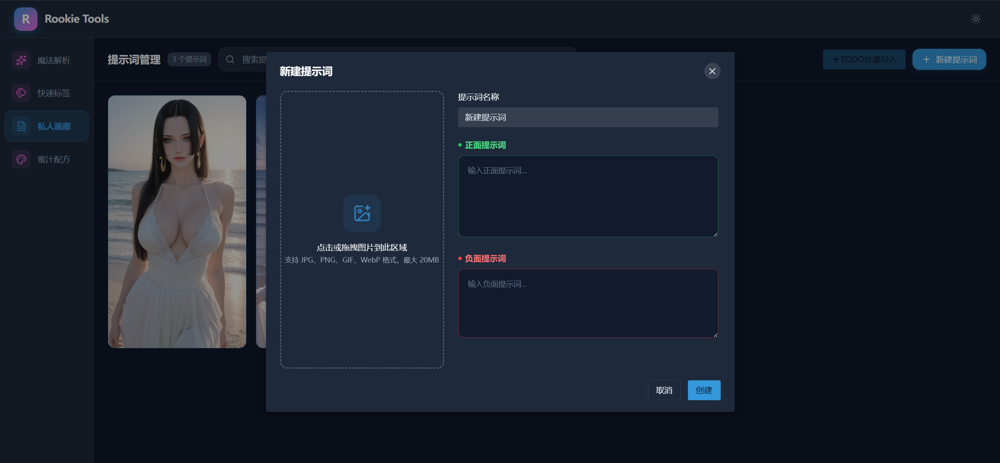
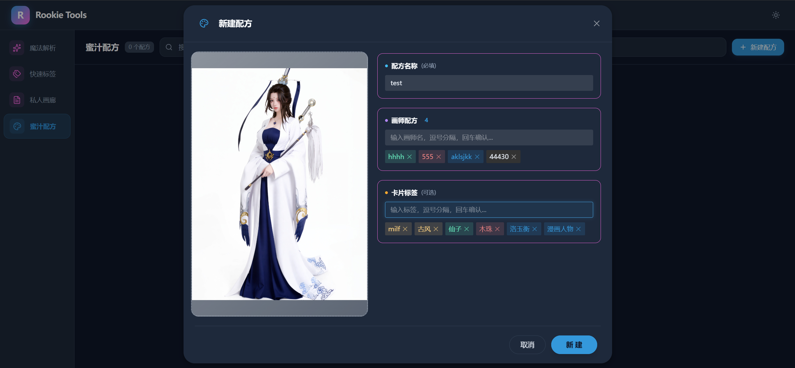
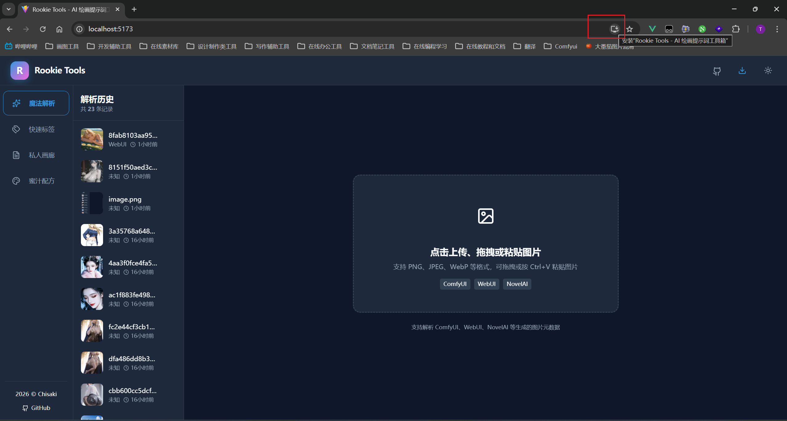
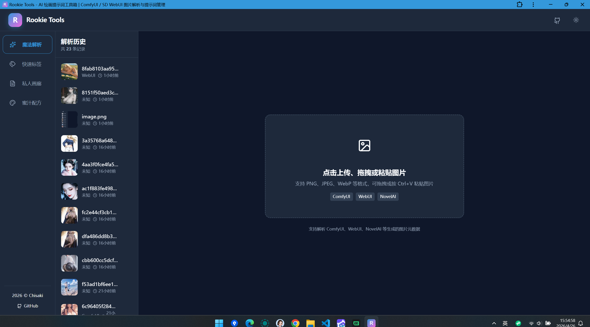

# Rookie Tools 🧰

> 面向 AI 绘画爱好者的本地离线 Prompt 工具箱

**Rookie Tools** 是一款专为 AI 绘画用户打造的浏览器端工具集，无需联网、无需安装，所有数据完全存储在本地浏览器中，保护你的隐私。

项目名称中的 "Rookie" 寓意帮助新手快速上手 AI 绘画，同时也代表开发者对技术成长的期许。

---

## ⚠️ 数据说明

> ⚠️ 所有导入的图片保存时会压缩处理,压缩会丢失图片原信息,请务必另存原图.

- **完全离线**：所有数据存储在浏览器 IndexedDB 中，无需联网
- **数据安全**：不会上传任何数据到服务器
- **自动清理**：解析历史最多保留 50 条，超出自动清理最旧记录
- **图片压缩**：上传的图片会自动压缩为缩略图（120×120）和预览图（短边 ≤900px），节省存储空间

---

## 核心功能

### 🪄 魔法解析

**将 AI 生成的图片拖入或上传，一键提取图片中嵌入的完整生成参数。**





- **支持多种生成器**：ComfyUI、Stable Diffusion WebUI (AUTOMATIC1111)、NovelAI
- **多种上传方式**：拖拽上传、点击选择、Ctrl+V 粘贴
- **自动识别生成器类型**，精准提取正向/负向提示词与生成参数
- **一键复制** 提示词，或 **导入到瀑布画廊** 永久保存
- **历史记录** 自动保存（最多 50 条），可随时回看

---

### 📝 瀑布画廊（提示词管理）

**集中管理你的提示词库，以瀑布流卡片形式展示，支持创建、编辑、搜索和快速复制。**







- **创建提示词**：弹窗式创建，可关联预览图
- **来源标识**：区分「魔法导入」和「手动创建」
- **搜索过滤**：按名称或提示词内容模糊搜索
- **快速复制**：详情页可分别复制正向/负向提示词
- **与魔法解析联动**：解析结果可一键导入，携带图片与完整参数

---

### 🎨 蜜汁配方（画师串管理）

**管理你的画师组合「配方」，以瀑布流图片卡片展示，支持双格式一键复制。**



- **创建配方**：输入画师名（逗号分隔），自动去重
- **双格式复制**：SDXL 格式 `(artist:name:1)` 和 Anima 格式 `@name`
- **图片关联**：每个配方可关联参考图
- **搜索过滤**：按配方名或画师名搜索

---

### 🏷️ 快速标签

> ⚠️ 此模块尚未开发，当前仅有早期 Demo。

规划中的标签快速选择器，帮助你高效组合提示词标签。

---

### 📱 PWA 支持

**将应用安装到桌面/主屏幕，离线使用全部功能。**

- **一键安装**：浏览器自动检测可安装状态，点击即可触发原生安装弹窗
- **完全离线**：安装后断网仍可使用所有功能（Service Worker 预缓存全部静态资源）
- **独立窗口**：以无地址栏的独立窗口运行，体验接近原生应用
- **自动更新**：检测到新版本时显示更新通知，一键刷新生效

**安装方式**：

1. 访问已部署的应用地址
2. 浏览器地址栏右侧会出现「安装」图标（或弹窗提示）
3. 点击安装，确认后应用即添加到桌面/主屏幕
4. 以后可直接从桌面图标启动，体验接近原生 App



**应用预览**



**浏览器支持**：
| 浏览器 | 支持状态 | 备注 |
| ------- | -------- | -------------------------------- |
| Chrome | ✅ 完整 | 推荐，全功能支持 |
| Edge | ✅ 完整 | Chromium 内核，同 Chrome |
| Firefox | ⚠️ 有限 | 支持离线，但安装入口较隐蔽 |
| Safari | ✅ 完整 | iOS/macOS 均支持「添加到主屏幕」 |

**离线使用**：

- 首次访问时会自动缓存所有静态资源
- 安装后即使断网也可完整使用所有功能
- 数据存储在本地 IndexedDB，无需联网

---

## 技术架构

| 层级     | 技术                    | 说明                               |
| -------- | ----------------------- | ---------------------------------- |
| 框架     | Vue 3 + TypeScript      | Composition API + `<script setup>` |
| 构建     | Vite 5                  | 快速开发与构建                     |
| UI 组件  | Naive UI                | 按需自动导入                       |
| 状态管理 | Pinia                   | 全局状态管理                       |
| 样式     | Tailwind CSS            | 原子化 CSS + CSS 变量主题          |
| 本地存储 | IndexedDB               | 完全离线，数据不出设备             |
| 图片解析 | ExifReader              | 读取图片 EXIF/PNG 元数据           |
| 瀑布流   | @yeger/vue-masonry-wall | 自适应瀑布流布局                   |
| 图标     | Lucide Vue Next         | SVG 图标库                         |
| UUID     | cuid2                   | 生成 UUID 用于数据唯一标识         |
| PWA      | vite-plugin-pwa         | 离线缓存、可安装、Service Worker   |

### 项目目录结构

```
rookie-tools/
├── public/                     # 静态资源
├── src/
│   ├── assets/                 # 静态资源文件
│   ├── components/             # 全局通用组件
│   │   ├── layout/             # 布局组件
│   │   ├── ui/                 # UI 基础组件
│   ├── composables/            # 组合式函数 (Composables)
│   ├── modules/                # 核心功能模块
│   ├── services/               # 服务层（数据库、解析等）
│   ├── stores/                 # Pinia 状态仓库
│   ├── styles/                 # 全局样式与主题配置
│   ├── types/                  # TypeScript 类型定义
│   ├── utils/                  # 工具函数
│   ├── App.vue                 # 根组件
│   └── main.ts                 # 应用入口
├── docs/                       # 项目文档
├── index.html                  # HTML 入口
├── vite.config.ts              # Vite 构建配置
├── tailwind.config.js          # Tailwind CSS 配置
└── package.json                # 项目依赖
```

---

## 使用指南

> ⚠️ 目前项目处于开发阶段，功能仍在完善中.暂未适配非编程人员使用方法,可先使用在线版.

### 环境要求

| 工具    | 最低版本                       | 说明                        |
| ------- | ------------------------------ | --------------------------- |
| Node.js | ≥ 18.0.0                       | 推荐 LTS 版本               |
| npm     | ≥ 9.0.0                        | 随 Node.js 一同安装         |
| 浏览器  | Chrome / Edge / Firefox 最新版 | 需支持 IndexedDB 与 ES2020+ |

> 💡 项目使用 Vite 5 + Vue 3.5 构建，需要 Node.js 18+ 以确保原生 ESM 和相关构建特性正常工作。

### 快速开始

```bash
# 安装依赖
npm install

# 启动开发服务器
npm run dev

# 构建生产版本
npm run build
```

启动后访问 `http://localhost:5173` 即可使用。

---

## 功能总览与开发进度

| 功能模块   | 状态      | 完成度 | 备注                           |
| ---------- | --------- | ------ | ------------------------------ |
| 魔法解析   | ✅ 已完成 | ~95%   | 支持 ComfyUI / WebUI / NovelAI |
| 私人画廊   | ✅ 已完成 | ~90%   | 批量导入待开发                 |
| 蜜汁配方   | ✅ 已完成 | ~95%   | 画师串 CRUD + 双格式复制       |
| 快速标签   | ❌ 未开发 | ~0%    | 仅有早期 Demo，需重做          |
| 主题切换   | ✅ 已完成 | 100%   | 深色/浅色主题同步              |
| 本地持久化 | ✅ 已完成 | 100%   | IndexedDB 全量存储             |
| PWA 支持   | ✅ 已完成 | 100%   | 可安装 + 离线访问 + 更新提示   |

---

## 🚀 版本发布

> 本项目已配置 GitHub Actions 自动化发布流程，支持一键创建正式版或预发布版本。

### 发布流程

```bash
# 方式一：使用 npm scripts（推荐）
# 升级修订号 (0.2.0 → 0.2.1)
npm run release:patch

# 升级次版本号 (0.2.0 → 0.3.0)
npm run release:minor

# 升级主版本号 (0.2.0 → 1.0.0)
npm run release:major

# 方式二：手动发布
# 1. 更新 package.json 的 version 字段
# 2. 创建 Git 标签（必须符合语义化版本格式）
git tag v0.3.0
git push origin master --follow-tags
```

### 工作流说明

| 步骤 | 说明 |
|------|------|
| **触发条件** | 推送 `v*.*.*` 或 `v*.*.*-*` 格式的标签 |
| **自动构建** | 安装依赖并执行 `npm run build` |
| **打包产物** | 将 `dist` 目录打包为 `rookie-tools-v*.zip` |
| **发行说明** | 从 `CHANGELOG.md` 提取或从 Git Log 自动生成 |
| **Release 创建** | 在 GitHub Releases 创建版本页面并上传打包文件 |

### 获取发行包

访问 [GitHub Releases](../../releases) 页面下载对应版本的 ZIP 包：

1. 解压到任意目录
2. 使用静态文件服务器运行：`npx serve dist`
3. 或直接用浏览器打开 `index.html`

---

## 使用建议

1. **日常使用**：先在「魔法解析」中解析 AI 生成图，一键导入到「瀑布画廊」永久保存
2. **画师管理**：在「蜜汁配方」中维护常用画师组合，需要时一键复制到剪贴板
3. **提示词积累**：在「私人画廊」中建立个人提示词库，按来源分类管理
4. **浏览器建议**：推荐使用 Chrome / Edge / Firefox 最新版本以获得最佳体验

---

_最后更新：2026-04-26 22:50_
